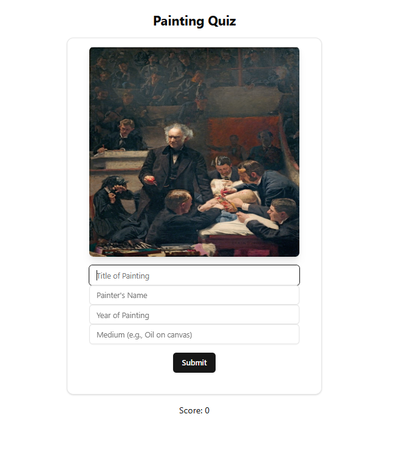

# 🎨 Painting Quiz App

## 📌 Overview
This is a **frontend-based quiz application** where users identify paintings by entering details such as the **title, painter, year, and medium**. Users earn points for correct answers, and paintings appear in a **randomized order with no repetitions**.

## 🚀 Features
- 🎨 **Randomized Image Display** (no repeats per session)
- ✅ **User Input Validation** (checks title, painter, year, and medium)
- 📊 **Score Tracking** (correct answers increase score)
- 🔄 **Fully Responsive UI**
- ⚡ **Built with Next.js and React**

## 🛠️ Technologies Used
- **Next.js** (React framework)
- **Framer Motion** (animations)
- **Tailwind CSS** (styling)
- **ShadCN/UI** (UI components)

## 📂 Project Structure
```
project-root/
│── src/
│   ├── components/
│   │   ├── images/      # Image files
│   │   │   ├── index.js  # Image imports
│   │   ├── paintings.js  # Painting details
│   │   ├── midsem.js     # Quiz component
│   ├── app/
│   │   ├── page.js       # Main entry file
│── public/               # Static assets
│── package.json          # Dependencies
│── README.md             # Documentation
```

## 📦 Installation & Setup

1. **Clone the Repository**
```sh
git clone https://github.com/your-username/painting-quiz-app.git
cd painting-quiz-app
```

2. **Install Dependencies**
```sh
npm install
```

3. **Start the Development Server**
```sh
npm run dev
```

4. **Open in Browser**
```
http://localhost:3000
```

## 🎯 How to Play
1. View the displayed painting.
2. Enter the **Title**, **Painter's Name**, **Year**, and **Medium**.
3. Click **Submit**.
4. Get instant feedback and move to the next painting.
5. At the end, the **total score** is displayed.

## 📸 Screenshot
> 

## 🔥 Future Enhancements
- Add **hints** for difficult paintings
- Integrate **database** for saving scores
- Add **timer-based scoring**

## 🤝 Contribution
Feel free to **fork** this repository, open **issues**, and submit **pull requests**!

## 📝 License
This project is **open-source** under the **MIT License**.

